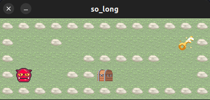

# Fabrício Esper
Estudante de engenharia de software na 42 Rio e entusiasta de sistemas operacionais.

Algumas tecnologias que estou estudando:

- C
- Linux
- Git
- Shell Script

## so_long

Projeto so_long feito na 42 Rio:

### Meu perfil no GitHub

